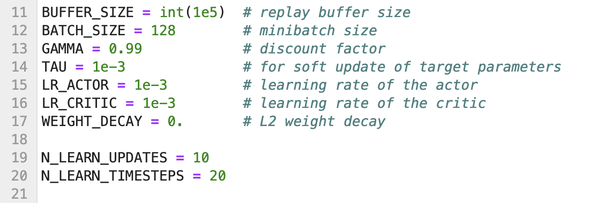
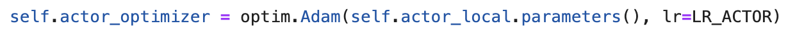
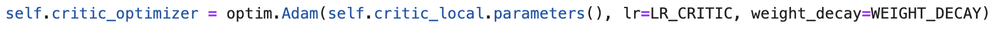
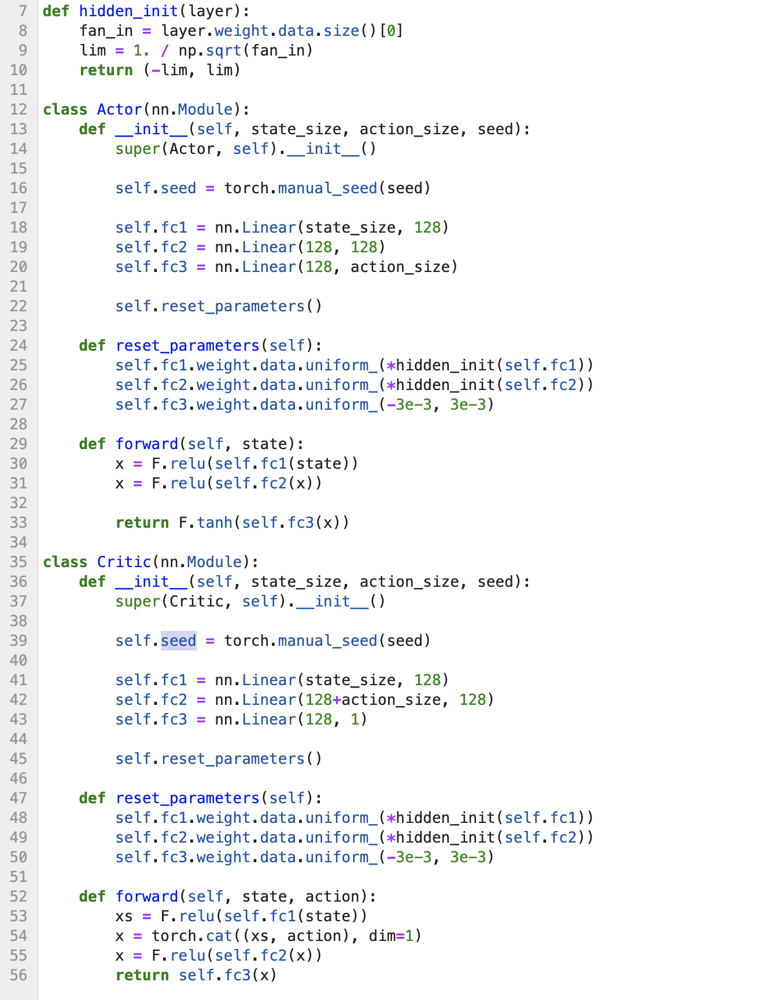
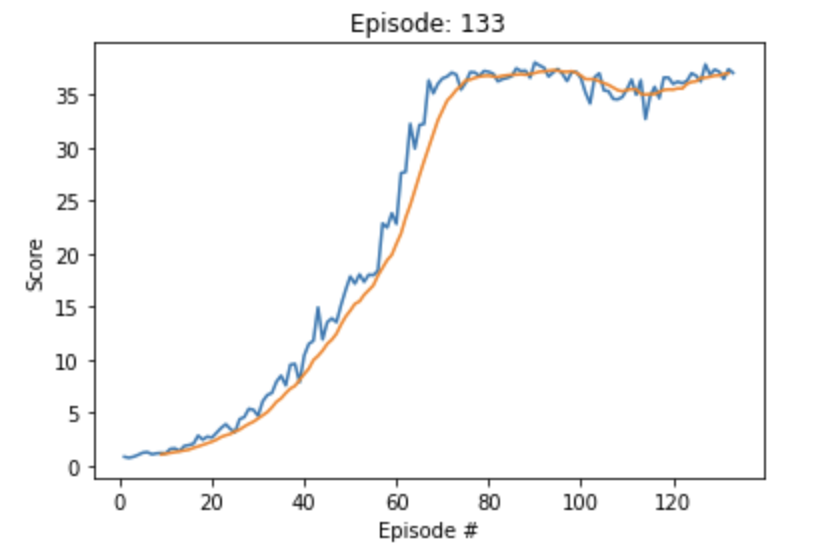

# Project 2: Continuous Control

## Description of the implementation

### DDPG: Deep Deterministic Policy Gradient

Deep Deterministic Policy Gradient (DDPG) is an algorithm which concurrently learns a Q-function and a policy. It uses off-policy data 
and the Bellman equation to learn the Q-function, and uses the Q-function to learn the policy. This approach is closely connected to Q-learning, 
and is motivated the same way. 

#### Quick Facts
- DDPG is an off-policy algorithm.
- DDPG can only be used for environments with continuous action spaces.
- DDPG can be thought of as being deep Q-learning for continuous action spaces.
- The Spinning Up implementation of DDPG does not support parallelization.

### Code Implementation

- model.py: This python file includes the code for the Actor and Critic models used by the agents to learn through forward and backpropogation methods.
Both models consist of 3 fully connected layers, along with 2 ReLU activation functions on the first 2 layers. The Actor model accepts the environment's 
state dimensions as input and its output size depends on the agent's action size.
- agent.py: The python file defines both the DDPG Agent and DDPG Replay Buffer, along with the OUNise class which is known as the Ornstein-Uhlenbeck process.
- P2_Continuous-Arm-Simulation.ipynb: This Jupyter Lab Notebook imports the necessary packages, examine that environment's state and action spaces, train the agent and plot 
the obtained results.

### Hyper-Parameters

#### Parameters defined in the 'agent.py' file:

#### Optimizers:

#### Neural Network Architectures: 

#### Plotted Results:

### Future Work

There are other actor-critic algorithms proposed to solve this kind of environment. So, future works may implement them to verify their performance. 
Some of those algorithms are:  
   * [TRPO - Trust Region Policy Optimization](https://arxiv.org/abs/1502.05477)
   * [GAE - Generalized Advantage Estimation](https://arxiv.org/abs/1506.02438)
   * [A3C - Asynchronous Advantage Actor-Critic](https://arxiv.org/abs/1602.01783)  
   * [PPO - Proximal Policy Optimization](https://arxiv.org/pdf/1707.06347.pdf)
   * [D4PG - Distributed Distributional Deterministic Policy Gradients](https://arxiv.org/pdf/1804.08617.pdf)
